# ☁️ CloudFunFacts

Uma aplicação serverless desenvolvida na AWS que gera curiosidades sobre computação em nuvem utilizando Inteligência Artificial.

---

# 🎯 Objetivo

CloudFunFacts foi criado para consolidar conhecimentos em arquitetura cloud, computação serverless, APIs REST, bancos de dados NoSQL e integração com modelos generativos utilizando serviços AWS.

O sistema busca curiosidades armazenadas no DynamoDB, envia o conteúdo para o Amazon Bedrock e retorna uma versão mais divertida e explicativa para o usuário através de uma interface web simples.

---

# 🏗️ Arquitetura

Fluxo da aplicação:

Usuário → Front-End → API Gateway → AWS Lambda → DynamoDB + Amazon Bedrock → Resposta ao Usuário

---

# 🚀 Serviços AWS Utilizados

- AWS Lambda
- Amazon API Gateway
- Amazon DynamoDB
- Amazon Bedrock (Claude Sonnet)
- Amazon CloudWatch

---

# 🔥 Destaques Técnicos

- Arquitetura Serverless
- API REST com API Gateway
- Funções AWS Lambda em Python
- Banco NoSQL DynamoDB
- Integração com Amazon Bedrock
- Monitoramento com CloudWatch
- Front-end consumindo API via JavaScript

---

# 📁 Estrutura do Projeto

```text
CloudFunFacts/
├── FrontEnd/
│   └── index.html
├── Lambda/
│   └── lambda_function.py
├── Screenshots/
│   ├── 00-api-json.png
│   ├── 01-frontend-inicial.png
│   ├── 02-curiosidade-rds.png
│   ├── 03-curiosidade-cloudfront.png
│   ├── 04-curiosidade-serverless.png
│   ├── 05-curiosidade-netflix.png
│   └── aws/
│       ├── 06-lambda-overview.png
│       ├── 07-lambda-test-success.png
│       ├── 08-api-gateway-route.png
│       ├── 09-dynamodb-items.png
│       ├── 10-dynamodb-table.png
│       ├── 11-bedrock-inference-profile.png
│       ├── 12-cloudwatch-logs.png
│       └── 13-api-gateway-stage.png
└── README.md
```

---

# 📸 Screenshots

## Front-End

### Tela inicial da aplicação

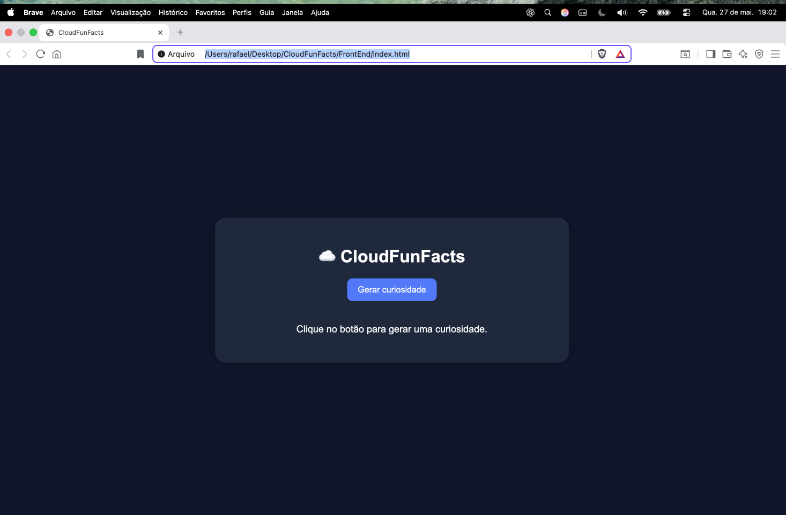

### Exemplo de curiosidade gerada

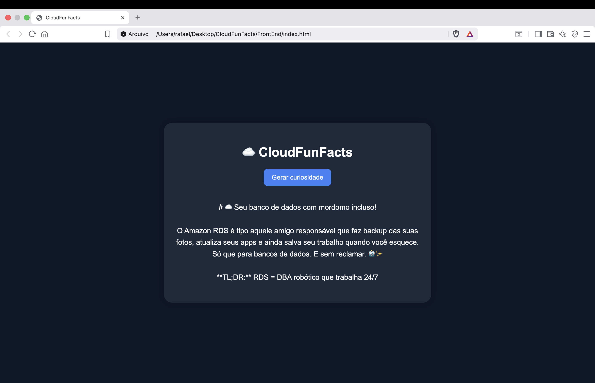

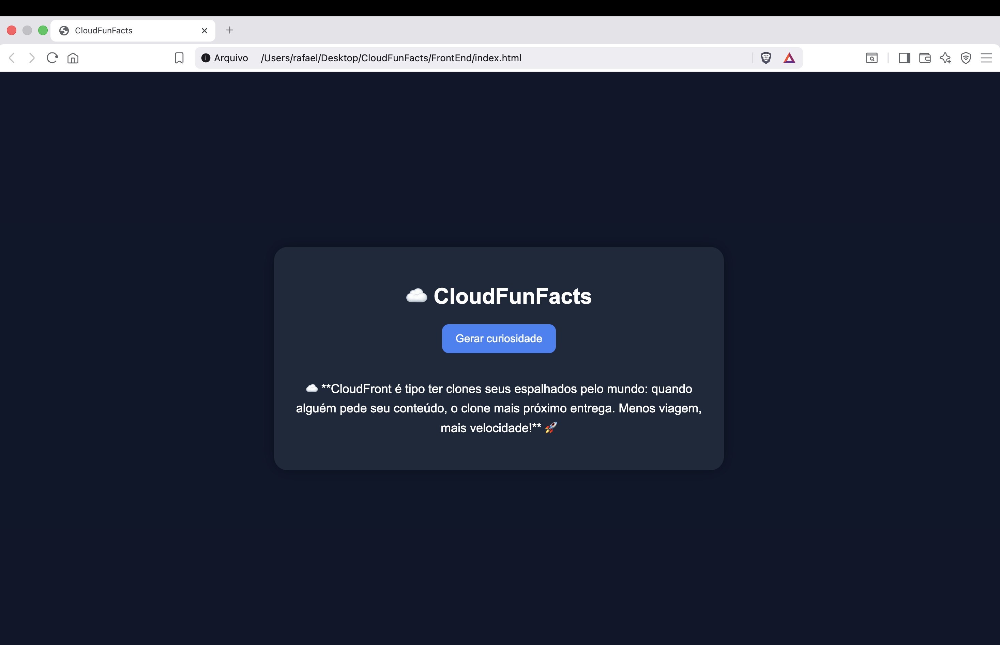

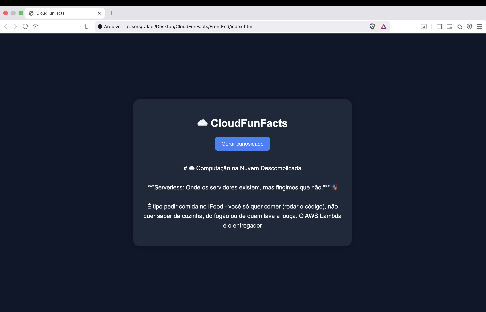

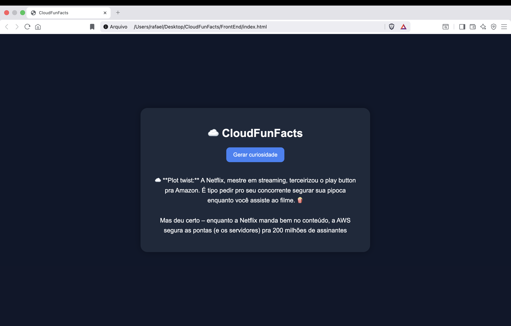

---

## AWS Lambda

### Visão geral da função Lambda

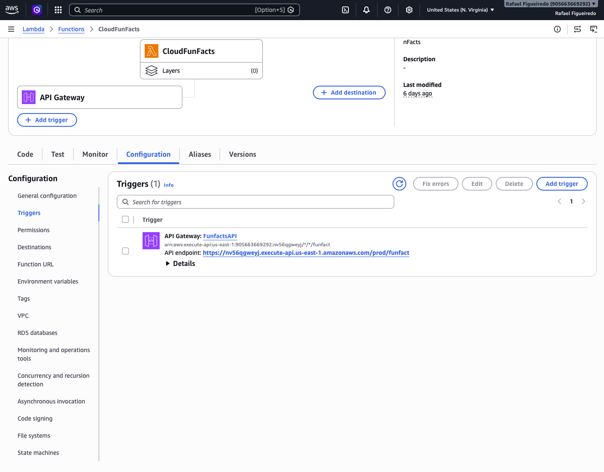

### Teste executado com sucesso

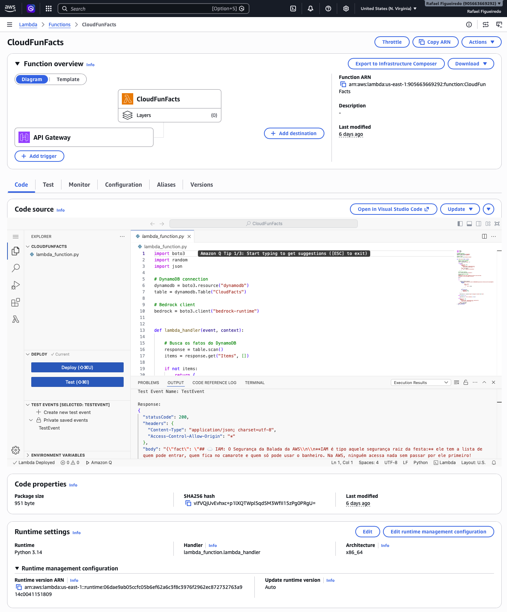

---

## API Gateway

### Rota GET da API

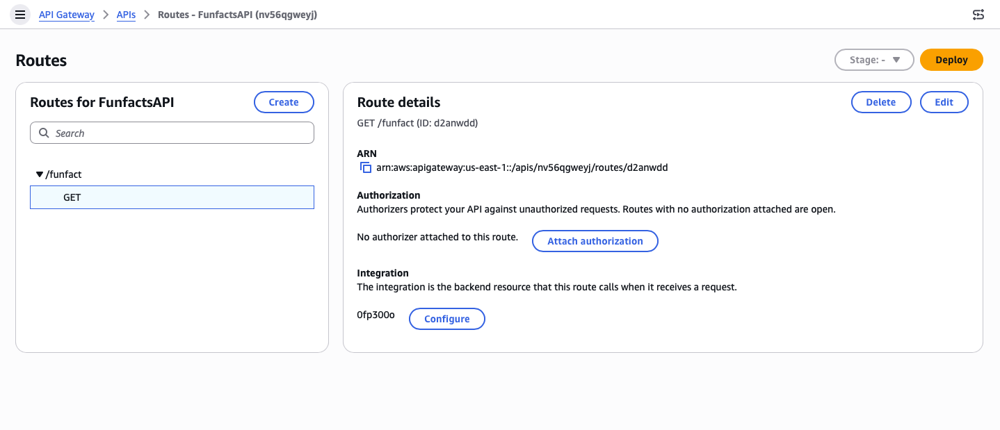

### Stage publicado

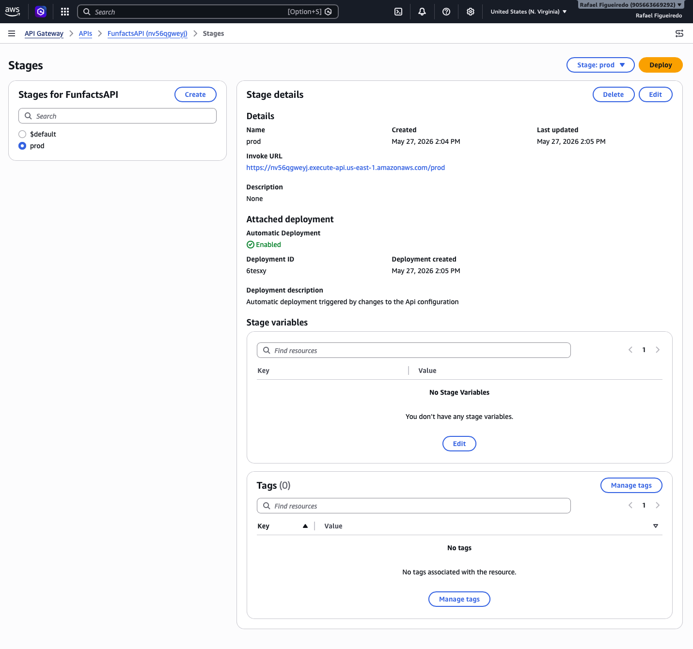

---

## DynamoDB

### Tabela CloudFacts

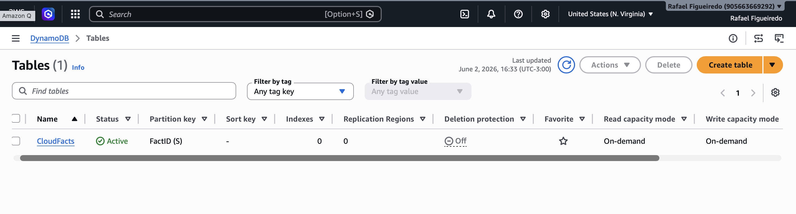

### Itens armazenados

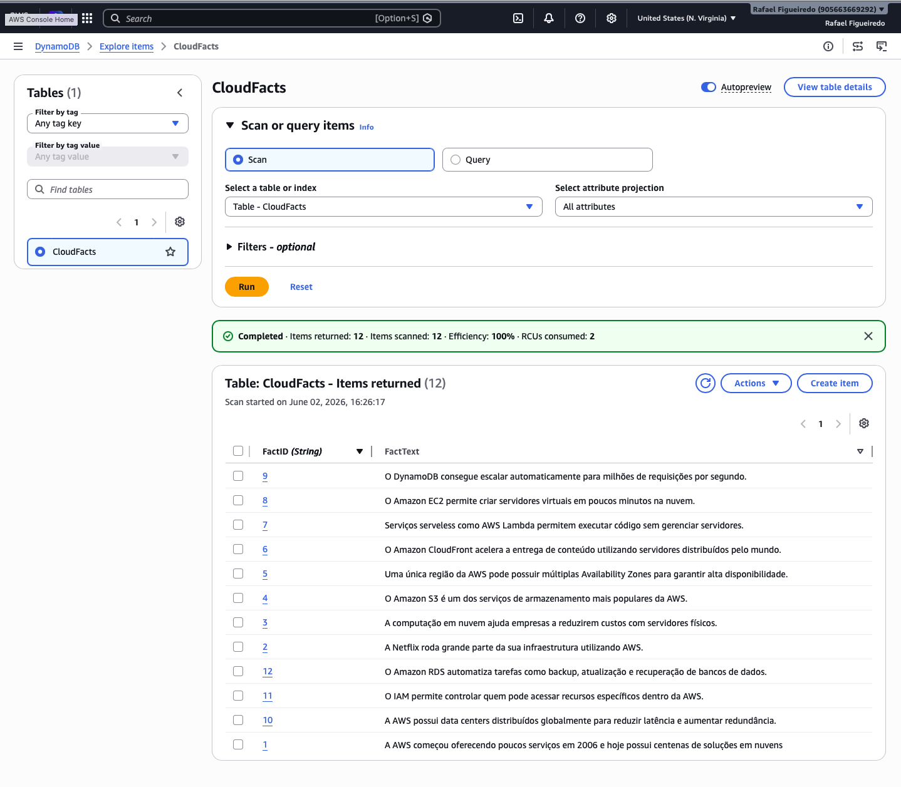

---

## Amazon Bedrock

### Inference Profile utilizado

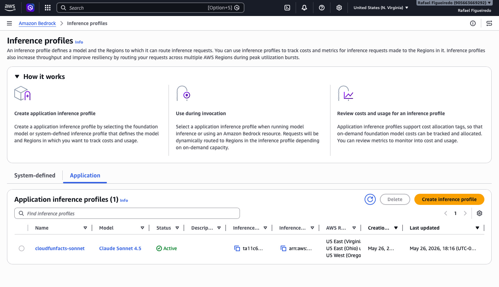

---

## CloudWatch

### Logs da aplicação

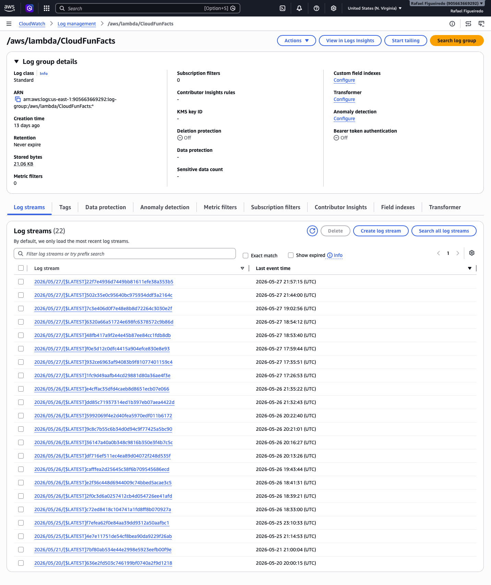

---

# 📚 Aprendizados

Durante o desenvolvimento deste projeto foram praticados conceitos de:

- Computação Serverless
- APIs REST
- Integração entre serviços AWS
- Bancos de dados NoSQL
- Observabilidade e monitoramento
- Inteligência Artificial Generativa
- Desenvolvimento Front-End

---

# 👨‍💻 Autor

Rafael Figueiredo

Projeto autoral desenvolvido para demonstrar conhecimentos em Cloud Computing, Serverless Architecture e Inteligência Artificial aplicada à A